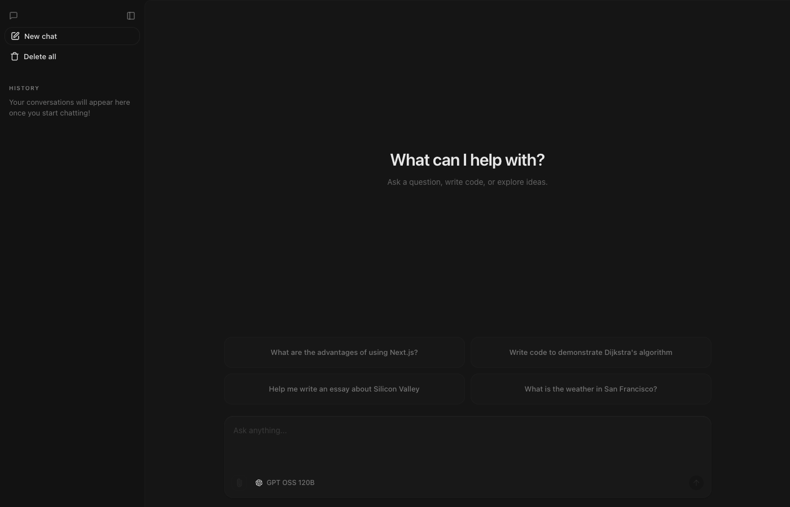

# Mukesh's AI Portfolio Chatbot

<p align="center">
  
</p>

<p align="center">
  A premium, open-source AI Portfolio Assistant built with <strong>Next.js 15+ (App Router)</strong>, the <strong>Vercel AI SDK</strong>, and direct <strong>Google Gemini 2.0 Flash</strong> integration. Customized showcase for <strong>PODUGU MUKESH</strong> (Full-Stack & AI Engineer).
</p>

<p align="center">
  <a href="https://ai-chatbot-teal-beta.vercel.app"><strong>Live Demo</strong></a> ·
  <a href="#features"><strong>Key Features</strong></a> ·
  <a href="#tech-stack"><strong>Tech Stack</strong></a> ·
  <a href="#running-locally"><strong>Running Locally</strong></a> ·
  <a href="#contact"><strong>Contact</strong></a>
</p>

---

## 🌟 Live Demo

The application is deployed and live at:
👉 **[https://ai-chatbot-teal-beta.vercel.app](https://ai-chatbot-teal-beta.vercel.app)**

*Featuring a customized Glassmorphism portfolio card, direct contact links, suggested questions about Mukesh's background, and direct Gemini responses.*

---

## 🚀 Key Features

* **Direct Gemini 2.0 Flash Integration**: Leverages `@ai-sdk/google` for ultra-fast, direct responses without routing latency.
* **Glassmorphic Portfolio Dashboard**: A modern, interactive landing card displaying contact information, resume details, and professional badges with micro-animations.
* **Suggested Actions**: Pre-configured question cards helping visitors learn about Mukesh's technical skills, projects, and contact info.
* **Neon Serverless Postgres**: Persistent chat history and guest sessions backed by serverless PostgreSQL via Drizzle ORM.
* **Auth.js (v5)**: Clean and secure authentication handling for both guest and regular users.
* **BotID Protection**: Invisible bot protection (powered by Vercel) safeguarding high-value route interactions.

---

## 🛠️ Tech Stack

* **Framework**: [Next.js 15 (App Router)](https://nextjs.org) with React Server Components (RSCs) & Turbopack
* **AI Engine**: [Vercel AI SDK](https://ai-sdk.dev) & `@ai-sdk/google` (Gemini 2.0 Flash)
* **Styling**: [Tailwind CSS v4](https://tailwindcss.com) & [Framer Motion](https://framer.com/motion)
* **Database & ORM**: [Neon Postgres](https://neon.tech) & [Drizzle ORM](https://orm.drizzle.team)
* **Auth**: [Auth.js (v5)](https://authjs.dev)

---

## 💻 Running Locally

To run the application locally on your machine, follow these steps:

### 1. Prerequisites
Make sure you have Node.js 18+ and `pnpm` installed.

### 2. Clone and Install Dependencies
```bash
git clone https://github.com/mukeshpodugu/ai_chatbot.git
cd ai_chatbot
pnpm install
```

### 3. Environment Variables
Pull the pre-configured project environment variables from Vercel (or copy `.env.example` to `.env.local` and fill them out):
```bash
# Link local instance with Vercel project
npx vercel link
# Download production variables (including Neon Database & Gemini key)
npx vercel env pull .env.local --environment production
```

### 4. Run Migrations & Start Server
```bash
# Run database migrations
pnpm db:migrate
# Start dev server on http://localhost:3000
pnpm dev
```

---

## 📞 Contact & Hire

Feel free to connect or reach out regarding freelance, contract, or full-time roles:

* **Name**: Podugu Mukesh
* **Role**: Full-Stack & AI Engineer
* **Email**: [mukeshpodugu123@gmail.com](mailto:mukeshpodugu123@gmail.com)
* **Phone**: [+91 8143999463](tel:8143999463)
* **GitHub**: [github.com/mukeshpodugu](https://github.com/mukeshpodugu)
